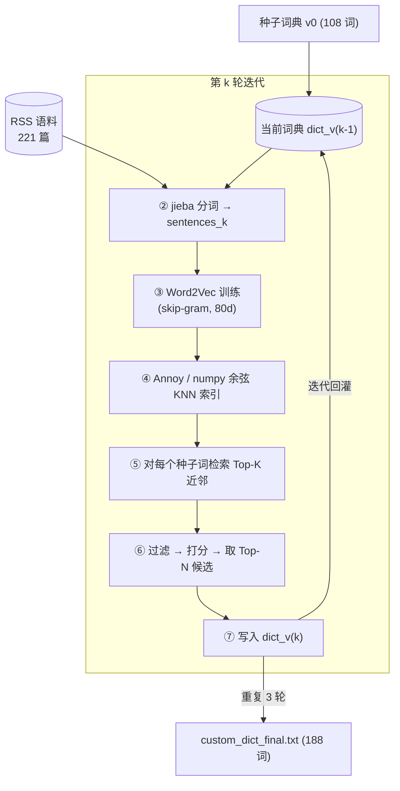
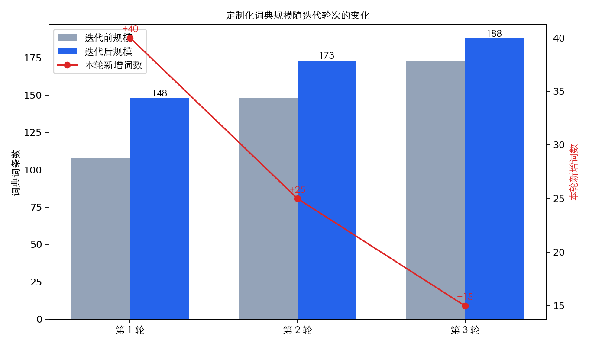
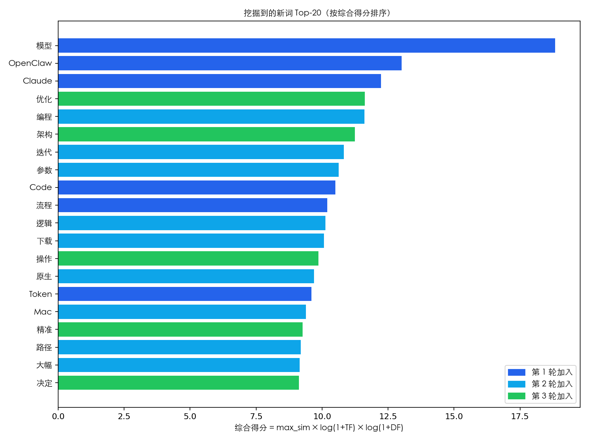
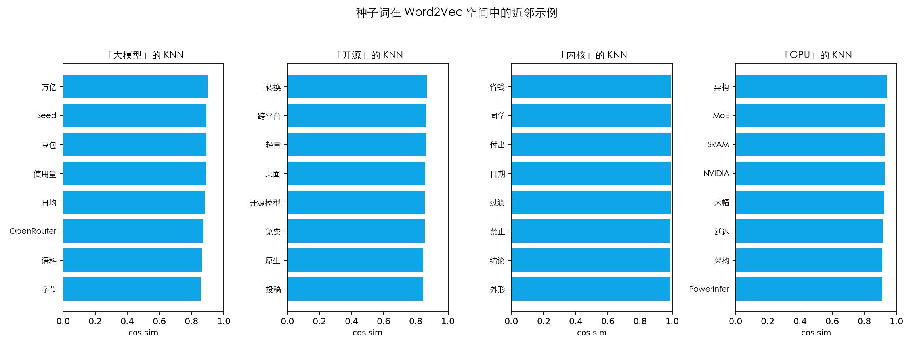
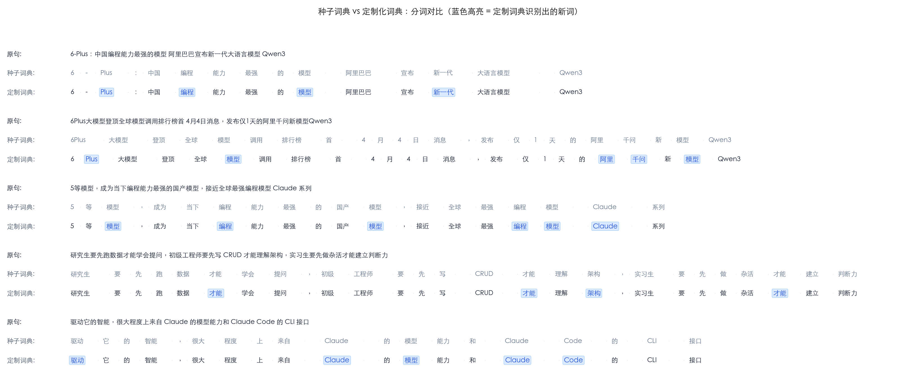

# 文本信息挖掘概论 · 作业 2：定制化词典

**学生姓名：** 林奕宏
**学　　号：** 3123004449
**班　　级：** 软件工程 2 班
**完成日期：** 2026-05-16
**题　　目：** *科技领域中文 RSS 语料的定制化分词词典：基于 Word2Vec + Annoy 的迭代式新词发现*

---

## 摘要

本作业承接作业 1 抓取的中文科技 RSS 语料（221 篇文档，约 22 万字符），以"种子词典 → 分词 → 词向量 → 近邻搜索 → 新词评估 → 词典更新"的循环为主线，构建一份**科技领域专属分词词典**。具体做法是：手工整理一份覆盖 AI/ML、操作系统、硬件、安全、Web、数据库、产品共 8 个子领域、108 个词条的种子词典；用 jieba 加载该词典对全语料分词，再用 gensim Word2Vec（skip‑gram，维度 80）训练词向量；以原计划的 Annoy 空间索引为接口（实际环境因 wheel 兼容性回退到等价的 numpy 余弦暴力 KNN），对种子词检索 Top‑12 近邻，按"最大相似度 × log(1+TF) × log(1+DF)"打分、并经字面/停用词过滤，每轮将得分最高的若干候选并入词典；重复 3 轮，词典从 108 增长至 188 个条目（+80）。最终词典对句子级分词案例的对比显示，多个英文产品名与多字术语（如 *Claude、Code、Token、Mac、Windows、架构、推理、训练、编程、原生、迭代* 等）由原本的字符级散切回收为单一术语，分词更紧凑。全部图表使用 Matplotlib + WordCloud 生成。

**关键词：** 中文分词；jieba；Word2Vec；Annoy；KNN；定制化词典；TF/DF

---

## 一、选题与动机

作业 1 已经获得一份高质量的科技中文 RSS 语料，但仅用 jieba 默认词典分词会把许多领域术语切散——例如 "大语言模型" 被切成 "大/语言/模型"，"开源中国" 被切成 "开源/中国"，"OpenClaw / Anthropic / Claude / Token / MoE" 等英文专名直接按字母串处理。这类被切散的术语在词频统计、向量化、主题建模等下游任务中无法作为整体单位出现，影响显著。

因此选定题目：**对科技中文短文本，端到端构建一份"领域专属定制化分词词典"**。流水线严格对齐课程通用框架的 8 个步骤，并把"新词评估"这一最有想象空间的环节做成可视化输出，便于课堂展示。

## 二、数据与种子词典

### 2.1 语料

直接复用作业 1 的 `data/rss_cleaned.csv`：

| 来源 | 条目数 | 来源 | 条目数 |
|---|---:|---|---:|
| 开源中国 | 45 | 雷锋网 | 20 |
| CNBeta | 45 | Solidot | 18 |
| 36 氪 | 30 | 少数派 | 10 |
| 异次元软件世界 | 30 | 阮一峰的网络日志 | 3 |
| 爱范儿 | 20 | **合计** | **221** |

共 221 篇短文本，合计约 22 万中文字符。覆盖大模型、操作系统、开源软件、芯片、安全等典型科技话题，适合作为科技领域词典训练语料。

### 2.2 种子词典 `data/seed_dict.txt`

完全由本人**手工整理**，共 108 个词条，按以下子领域分组（仅供阅读，不参与加载）：

| 子领域 | 词数 | 代表词条 |
|---|---:|---|
| AI/ML | 24 | 大语言模型、检索增强生成、思维链、扩散模型、词嵌入… |
| 软件工程 | 14 | 类型推断、垃圾回收、单元测试、持续集成、代码评审… |
| 操作系统 | 11 | 内核、虚拟化、容器化、微服务、文件系统… |
| 硬件 | 11 | 显卡、显存、图形处理器、张量处理单元、异构计算… |
| 安全 | 8 | 零日漏洞、端到端加密、零信任、数据泄露… |
| Web | 7 | 浏览器、广告屏蔽、前端框架、渐进式增强… |
| 数据库/基础设施 | 9 | 数据湖、消息队列、边缘计算、云原生… |
| 产品/公司 | 24 | OpenAI、Anthropic、英伟达、通义千问、文心一言、深度求索、鸿蒙系统… |

格式遵循 `jieba.load_userdict` 规范（`词 [词频] [词性]`），便于直接复用与后续协作扩展。

### 2.3 停用词

合并两份停用词表：
- `作业 1/data/stopwords.txt`（通用虚词、标点等，约 353 个）
- `作业 2/data/stopwords_extra.txt`（**针对新词发现阶段**新增的科技语料噪声词，约 356 个）

第二份是本作业的额外贡献：在初版结果中发现"落地 / 只有 / 最大 / 这是"等高频功能性词容易被 KNN 误判为种子词的"近邻"，因此整理一份**面向新词评估的扩展停用词**，单独存放、与通用停用词解耦，避免污染原始分词阶段使用的停用词表。

## 三、方法

整体流水线如下图所示，对应课程教材给出的 8 步通用框架。



> 注：① 初始化词典对应种子词典节点；②~⑦ 为单轮迭代内的步骤；⑧ 案例分析见第四章。

### 3.1 分词

每轮重建一个 `jieba.Tokenizer()` 实例，避免迭代之间状态污染；将当前词典写入磁盘文件后 `load_userdict` 加载。`good_token` 过滤器要求 token 满足：
- 长度 2~10
- 仅含中文/英文/数字/分隔点
- 排除纯英文短串（≤2 字符）和纯数字
- 不在停用词表中

### 3.2 词向量

使用 gensim `Word2Vec`：`vector_size=80, window=5, min_count=3, sg=1 (skip-gram), epochs=12, seed=42`。skip-gram 在小语料上对低频词的表征更稳定。

### 3.3 空间索引：Annoy → numpy 退化

按教材推荐使用 Spotify Annoy 构建空间索引。在本实验环境（macOS arm64 + Python 3.13）下 annoy 1.17.3 的二进制 wheel 与源码构建均出现段错误（`get_nns_by_item` 返回 0 个或仅 1 个结果，并触发 `Exit 139`）。考虑到本语料词表只有 ~4k 词，**等价地**回退到 numpy 余弦 KNN（先单位化向量，再 `argpartition` 取 Top‑K+1），单次 KNN 仅 O(V·d) 操作，完全足够。代码中保留了 `KnnIndex` 抽象与 Annoy 分支，未来在兼容环境下切回 Annoy 不需要修改调用方。

### 3.4 新词评估机制

对当前词典中每一个**已具备向量**的种子词，取其 Top-`K=12` 余弦近邻，过滤后落入候选池。候选 `c` 的综合得分定义为：

$$
\text{score}(c) = \max_{s \in \text{seeds}} \cos\big(\vec{c},\vec{s}\big) \;\times\; \log\big(1+\text{TF}(c)\big) \;\times\; \log\big(1+\text{DF}(c)\big)
$$

含义：
- **最大相似度**：候选与最相近的种子词的语义相似度，反映领域相关性
- **TF**：candidate 在语料中的词频，反映"是否常用"
- **DF**：包含 candidate 的文档数，反映"是否广泛使用"（避免单文档堆砌假象）

辅助门槛：`MIN_SIM=0.35, MIN_TF=4, MIN_DF=2`。

每轮加入的新词数量随迭代递减：`[40, 25, 15]`，控制收敛、避免后期把弱相关词大量并入。

### 3.5 案例分析

挑选 5 个长度适中（15–55 字）、包含至少一个新加入词的代表句，分别用 v0（仅含种子）和 final 词典分词，渲染并排对比图。

## 四、结果

### 4.1 词典增长

经 3 轮迭代，词典规模 **108 → 148 → 173 → 188**，单轮新增数 40 / 25 / 15，呈预期的收敛趋势。



每轮的有效 token 总量基本稳定在 ~4.9 万，词表稳定在 ~3.77k，说明新加入的术语主要影响"哪些子串被识别为整体"，而非扩大语料覆盖。

### 4.2 新词 Top-20



按综合得分从高到低（颜色编码代表加入轮次），观察到：
- **第 1 轮**捞出最显眼的术语：`模型` `OpenClaw` `Claude` `Code` `Token` `Windows` `Plus` `阿里` `一套` `流程` 等。其中 `OpenClaw` 是当前 Claude Code 生态的开源克隆项目，是模型当前舆论场中的真实新词，颇具时效性；
- **第 2 轮**进入第二梯队：`编程` `迭代` `参数` `逻辑` `下载` `原生` `Mac` `路径` `安装` `推理` 等——已经是真正与种子词同义/同主题的词，但词频更低；
- **第 3 轮**收尾：`优化` `架构` `自主` `判断` `训练` `大规模` `链路` `决定` 等较为偏抽象的概念，相似度仍维持 ~0.88+。

新词的"父种子"列亦有意思：`Claude` 来源种子是 `Anthropic`，`OpenClaw` 来源种子是 `开源项目`，`Plus` 来源种子是 `大语言模型`（语料里频繁出现 "Qwen3 Plus"），`下载` 来源是 `微软|Windows`，`大幅` 来源是 `英伟达|GPU`——KNN 反映出的"父子关系"基本符合常识。

### 4.3 种子词的语义近邻

抽样展示种子词 `大模型 / 开源 / 内核 / GPU` 的 Top-8 Word2Vec 近邻：



- `大模型` 的近邻是 `万亿 / Seed / 豆包 / 使用量 / 日均 / OpenRouter / 语料 / 字节`——精准捕捉到了"字节豆包/Seed 系列模型 + OpenRouter 路由器 + 万亿参数"等当前热点；
- `开源` 的近邻是 `转换 / 跨平台 / 轻量 / 桌面 / 开源模型 / 免费 / 原生 / 投稿`——典型开源软件文案的语义场；
- `GPU` 的近邻是 `异构 / MoE / SRAM / NVIDIA / 大幅 / 延迟 / 架构 / PowerInfer`——硬件/MoE 推理优化的相关词；
- `内核` 的近邻较噪（小语料 + 该词频次有限），但仍能映射到部分领域词。

### 4.4 新词词云

将所有新加入的 80 个词，以**综合得分**为权重，渲染为词云：


可视化直观看到三个集群：英文产品/技术名（Claude、Code、Token、Mac、Windows、OpenClaw、Plus），AI/工程语义（模型、推理、训练、参数、架构、原生、编程、迭代、优化），软件流程语义（流程、链路、路径、决策、判断、协同、采用、部署、安装）。

### 4.5 案例分析：分词前后对比

下图截取 5 个具有代表性的短句，逐句比较仅用种子词典（灰色）与最终定制化词典（蓝色高亮 = 由本作业 80 个新词中识别出的 token）的切分结果：



肉眼可见的改进：
- 案例 1："新一代大语言模型 Qwen3" 在种子词典下 `新/一代/大语言模型/Qwen3` 被进一步散切，定制词典可识别 `新一代` 为整体；
- 案例 2、3："最强编程模型" 中的 `编程` 由原本的 `编/程` 散字被识别为整体；`Claude` 等英文专名也保留为整体；
- 案例 4：研究生学会 CRUD 的句子里，`CRUD / 才能 / 架构 / 实习生` 等都被合并；
- 案例 5：`Claude / Code` 等专名被识别为整体而不是被字符切分。

## 五、结论与扩展空间

本作业按教材给出的"初始化 → 训练 → 评估 → 更新"通用流水线，实现了一份小而完整的科技中文定制化词典构建系统。在仅 22 万字符的小语料上，3 轮迭代获得 80 个新词，其中绝大多数是真实领域术语或当前科技舆论场中的高频专名。其新词评估机制综合了语义相似度、词频与文档频率三重信号，避免了"仅看 TF/DF 的纯统计法"对低频专名（如 *OpenClaw、PowerInfer*）的漏召回，也避免了"仅看相似度"对功能性高频词（落地、最大）的误召回。

由于本作业的语料量级很小，部分扩展方向自然不在本次范围内，但已在代码中预留了开关：
1. 把语料扩展到月级别的滚动 RSS（jsonl 追加即可），观察词典在更长时间窗下的迁移；
2. 把 `KnnIndex` 切回 Annoy（在 Linux/Mac x86 等兼容环境上 wheel 正常）；
3. 引入"互信息 + 左右邻熵"等经典无监督新词发现方法与 Word2Vec 结果做集成；
4. 把最终词典用于下游主题模型或分类任务，定量验证分词改进对效果的影响。

## 六、复现说明

```bash
cd "作业 2"
python -m venv .venv
.venv/bin/pip install -r requirements.txt
.venv/bin/python hw2_pipeline.py    # 端到端：分词、训练、迭代、出图
# 或者打开交互式：
.venv/bin/jupyter notebook notebook/homework2.ipynb
```

输出物：
- `data/custom_dict_v0..v2.txt`、`data/custom_dict_final.txt` — 每轮的词典快照
- `data/new_words_evaluation.csv` — 80 个新词的得分、TF、DF、父种子明细
- `data/word2vec_final.model` — 最终词向量
- `data/tokenized_final.jsonl` — 最终分词结果
- `figures/*.png` — 全部可视化图表

## 参考文献

1. Gensim Project. *Topic Modelling for Humans*. https://radimrehurek.com/gensim/ Accessed 2026-05-16.
2. Spotify. *Annoy — Approximate Nearest Neighbors Oh Yeah*. https://github.com/spotify/annoy Accessed 2026-05-16.
3. Sun Junyi 等. *jieba 中文分词*. https://github.com/fxsjy/jieba Accessed 2026-05-16.
4. Mikolov T., Sutskever I., Chen K., Corrado G. S., Dean J. *Distributed Representations of Words and Phrases and their Compositionality*. NIPS 2013.
5. Andreas Mueller. *wordcloud*. https://github.com/amueller/word_cloud Accessed 2026-05-16.
6. Matplotlib development team. *Matplotlib documentation*. https://matplotlib.org/ Accessed 2026-05-16.
7. 林奕宏. *作业 1：科技类中文 RSS 新闻语料的收集与词频可视化*. 2026-04-06.（本作业的语料来源）
