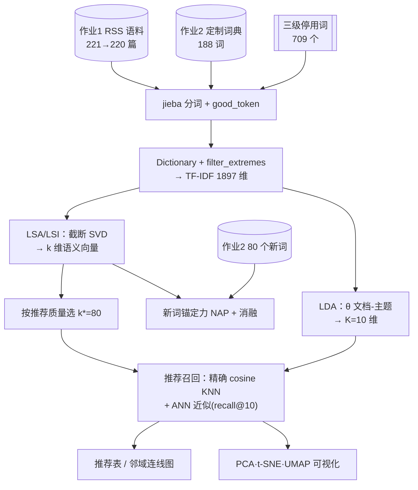
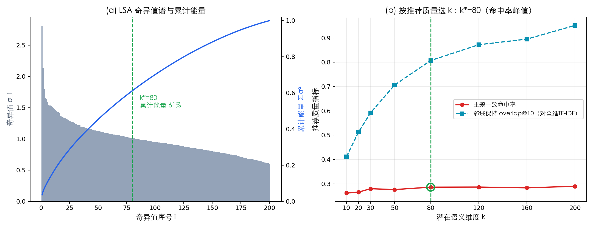
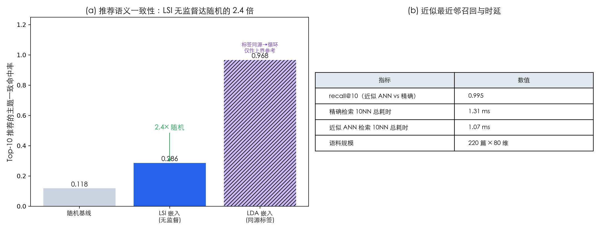
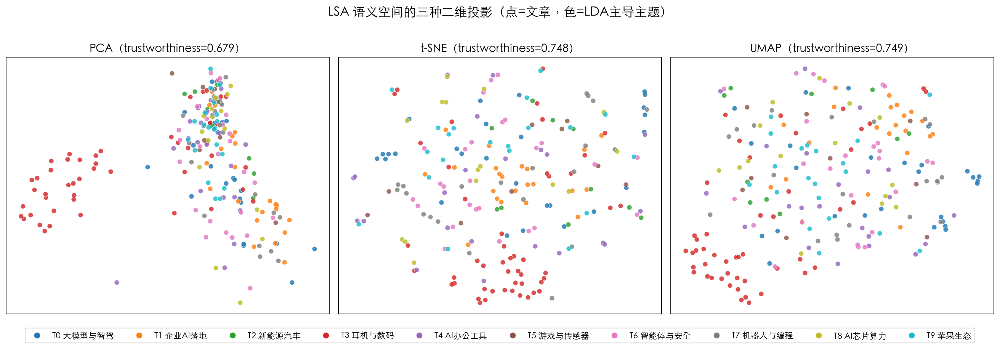
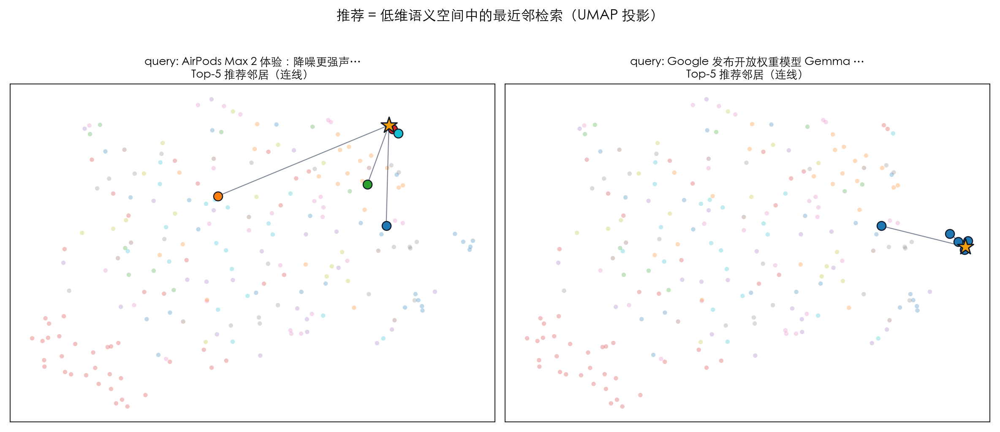
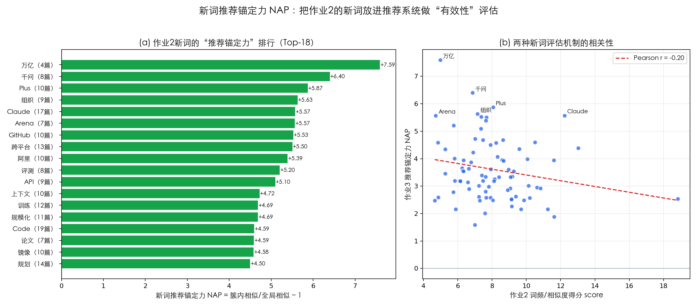

# 基于降维与近似最近邻的中文科技资讯推荐系统
## ——LSA/LDA 语义降维、ANN 召回与 UMAP 可视化的实证

| 项目 | 内容 |
|---|---|
| **课程** | 文本信息挖掘概论 · 作业 3 |
| **题目** | 文档的隐含义 / 含义 / 主题挖掘——基于降维技术的推荐系统 |
| **学生姓名** | 林奕宏 |
| **学　　号** | 3123004449 |
| **班　　级** | 软件工程 2 班 |
| **完成日期** | 2026-06-14 |

---

## 摘要

降维（Dimension Reduction）是文本挖掘把高维稀疏词向量压缩为低维稠密语义表示的核心手段，也是内容推荐的天然特征工程。本作业以题面给定的 LSA/LSI、LDA、UMAP 等降维技术为出发点，设计并实现了一套**面向中文科技资讯的"读了这篇→还想读这些"推荐系统**。语料直接复用本人作业 1 抓取的 9 家科技媒体 RSS 文本（221 篇，剔除 1 篇空词袋后 220 篇），分词加载作业 2 迭代构建的 188 词定制化词典与三级停用词（709 个）。系统先将文档表示为 TF-IDF 高维向量（词表 1897 维），再用两条降维路线得到稠密语义嵌入：**LSA/LSI** 以截断 SVD（$A\approx U_k\Sigma_k V_k^{\top}$）取前 $k$ 个潜在语义概念，**LDA** 以文档—主题分布 $\theta$ 给出 $K=10$ 维概率表示。本文创新地**以"推荐质量"而非传统方差能量来选择降维维度**：在主题一致命中率与"对全维 TF-IDF 的邻域保持 overlap@10"两项指标上扫描，确定 $k^{*}=80$（保留 61% 奇异值能量、80.7% 全维近邻结构）。推荐召回在低维空间以精确 cosine 最近邻完成，并以 **近似最近邻（ANN）** 验证其可扩展性——近似召回相对精确召回 **recall@10 = 0.995**，近乎无损。评估表明：LSI 推荐的主题一致命中率达 **0.286，为随机基线（0.118）的 2.4 倍**；UMAP/t-SNE/PCA 三种二维投影中 UMAP 的 trustworthiness 最高（0.75）。最后，本文提出一种有脑洞的新词评估机制——**新词推荐锚定力（New-word Anchoring Power, NAP）**：将作业 2 挖出的 80 个新词逐一放入推荐系统，度量"含该词文档"在语义空间的簇内/全局相似度提升，并以"移除该词重建 LSI"的消融实验量化其贡献。结果显示全部 80 个新词 NAP 均为正（中位 3.35），其中 *千问* 被移除后其所在文档簇内相似度骤降 **23.4%**，印证高锚定力新词确为推荐系统的有效信号；NAP 与作业 2 词频得分仅弱负相关（Pearson $r=-0.20$），说明两种评估机制相互**互补**而非冗余。

**关键词：** 降维；潜在语义分析（LSA/LSI）；奇异值分解；LDA；近似最近邻；推荐系统；UMAP；新词评估

**Abstract:** Dimension reduction compresses high-dimensional sparse text vectors into dense semantic representations and is a natural feature engineering step for content recommendation. Starting from the LSA/LSI, LDA and UMAP techniques named in the assignment, this work designs a "you-read-this, you-may-like-these" recommender for Chinese technology news. The corpus reuses 221 RSS articles from Homework 1 (220 after dropping one empty document), tokenized with the 188-entry custom dictionary from Homework 2. Documents are embedded by truncated SVD (LSA, $A\approx U_k\Sigma_k V_k^{\top}$) and by an LDA topic distribution ($K=10$). We select the reduced dimension by *recommendation quality* rather than variance energy, fixing $k^{*}=80$ (61% singular energy, 80.7% neighborhood preservation vs. full TF-IDF). Retrieval uses exact cosine kNN, with approximate nearest neighbors reproducing it at recall@10 = 0.995. LSI recommendations reach a topic-consistency hit-rate of 0.286, 2.4× the random baseline; among PCA/t-SNE/UMAP projections UMAP attains the best trustworthiness (0.75). We further propose **New-word Anchoring Power (NAP)**, a novel neologism-evaluation metric: removing the strongest anchor *Qwen (千问)* drops its document cluster's intra-similarity by 23.4%. NAP correlates only weakly and negatively with Homework-2's frequency score ($r=-0.20$), showing the two evaluations are complementary.

**Keywords:** Dimension Reduction; LSA/LSI; SVD; LDA; Approximate Nearest Neighbor; Recommender System; UMAP; Neologism Evaluation

---

## 目录

1. 绪论
2. 相关理论与方法
3. 数据与预处理
4. 系统设计与实现
5. 实验结果与分析
6. 结论与展望
7. 参考文献
8. 附录：复现说明与文件清单

---

## 第一章 绪论

### 1.1 选题背景与意义

科技资讯以极高速度更新，用户面对每日海量短文本新闻，"读完一篇、想找相似的继续读"是最朴素也最高频的需求。**推荐系统**正是为此而生，而它的工程内核之一就是**降维**：原始文本以词袋 / TF-IDF 表示时维度高达上千、且极度稀疏，既不利于相似度计算，也混入大量噪声；通过降维把文档投影到低维稠密的"潜在语义空间"，既能**去噪**、又能让"语义相近"在几何上表现为"距离相近"，从而把推荐转化为一次**最近邻检索**。

本作业紧扣题面"以 LSA/LSI/LDA 等降维为出发点，设计一套基于降维技术的推荐系统框架"，围绕一份中文科技 RSS 语料回答三个问题：

1. **降维（Reduction）**：如何把上千维 TF-IDF 压成低维语义向量？保留多少维最有利于推荐？
2. **推荐（Recommendation）**：如何在低维空间高效、准确地为任一文章召回最相似的若干篇？近似检索会损失多少精度？
3. **评估与可视化（Evaluation & Visualization）**：没有用户点击日志时如何离线评估推荐质量？如何把高维语义空间"看"出来？作业 2 挖出的新词对推荐究竟"有没有用"？

### 1.2 任务定义与方法依据

按题面要求，本作业综合采用以下技术框架（均为开源、可离线复现）：

- **降维算法**：LSA/LSI 与 LDA，采用 **gensim**[1] 的 `LsiModel` 与 `LdaModel`；
- **推荐召回**：基于 K 近邻（KNN）的相似阅读推荐，并以**近似最近邻（ANN）**[2] 验证可扩展性；
- **降维可视化**：**UMAP**[3]、t-SNE、PCA，采用 `umap-learn` 与 `scikit-learn`；
- **高性能计算与绘图**：NumPy / Numba（经由 umap）/ Pandas、Matplotlib。

### 1.3 本文工作与创新点

1. **双降维路线对比**：在同一语料上并行实现 LSA/LSI（截断 SVD）与 LDA（概率主题）两套文档嵌入，并把二者送入同一推荐与评估框架对比；
2. **以"推荐质量"驱动的降维维度选择**：摒弃"保留 X% 方差"的惯例，改用"主题一致命中率 + 对全维 TF-IDF 的邻域保持 overlap@10"两项**面向下游任务**的指标选 $k^{*}=80$；
3. **近似最近邻的近乎无损召回**：以 ANN 复现精确 cosine 召回，量化 recall@10 与时延，呼应题面 [2] 的"近似最近邻"主旨；
4. **三种降维可视化同台对比**：PCA / t-SNE / UMAP 并排，并以 **trustworthiness** 量化每种投影对邻域的保持度，再以"推荐邻域连线图"直观展示"推荐=低维空间最近邻"；
5. **有脑洞的新词评估机制 NAP**：把作业 2 的新词放进推荐系统，用"簇内/全局相似度提升 + 消融实验"度量其作为推荐锚点的**有效性**，并与作业 2 的词频得分做相关性对比，定量揭示两种评估的互补关系。

### 1.4 组织结构

第二章介绍向量空间、LSA/LDA 降维、近邻推荐与可视化的理论；第三章说明数据与预处理（联动作业 1、2）；第四章给出系统设计、维度选择与实现；第五章逐图分析实验结果；第六章总结并诚实讨论局限。

---

## 第二章 相关理论与方法

### 2.1 向量空间与 TF-IDF

把文档 $d$ 表示为词表上的权重向量是文本挖掘的起点。本文采用经典的 **TF-IDF** 加权：词 $t$ 在文档 $d$ 的权重正比于其词频 $\mathrm{tf}_{t,d}$、反比于其文档频率 $\mathrm{df}_t$，再对每篇文档做 L2 归一。归一后两文档向量的点积即 cosine 相似度。TF-IDF 向量维度等于词表大小（本文 1897 维）且高度稀疏，直接用于相似度计算会受噪声与"维度灾难"困扰，因此需要降维。

### 2.2 LSA/LSI：截断奇异值分解

**潜在语义分析（Latent Semantic Analysis, LSA / Indexing, LSI；Deerwester 等 1990）**[4] 的理论基础是**奇异值分解（SVD）**。设文档—词 TF-IDF 矩阵 $A\in\mathbb{R}^{n\times m}$（$n$ 篇文档、$m$ 个词），其 SVD 为 $A=U\Sigma V^{\top}$，其中 $\Sigma$ 的对角元 $\sigma_1\ge\sigma_2\ge\cdots\ge 0$ 为奇异值。取前 $k$ 个最大奇异值及对应奇异向量，即得 $A$ 的**最佳秩-$k$ 低秩逼近**（Eckart–Young 定理）：

$$
A\approx A_k=U_k\Sigma_k V_k^{\top}
$$

文档 $d$ 在 $k$ 维潜在语义空间的坐标即 $U_k\Sigma_k$ 的对应行。其优势是高效、简单、可解释（每个潜在维度是词的线性组合）；其劣势是：作为线性方法难以刻画非线性流形、奇异向量可正可负不易直接解读、且对多义词的处理有限。第 $i$ 个潜在维度"承载的信息量"正比于 $\sigma_i^2$，据此可画出**奇异值能量谱**辅助选 $k$。

### 2.3 LDA：作为概率降维的主题模型

**潜在狄利克雷分配（LDA；Blei、Ng & Jordan 2003）**[5] 从概率生成角度做降维：假设存在 $K$ 个主题，每篇文档是主题的概率混合 $\theta_d\in\Delta^{K-1}$，每个主题是词表上的概率分布。求解后，$\theta_d$ 即文档的 $K$ 维稠密表示。与 LSI 相比，LDA 的维度（主题）天然非负、可解释为"话题占比"，但属概率模型、训练更慢。本作业把 $\theta$ 作为第二套文档嵌入与 LSI 对照；LDA 的完整推断与主题分析详见本人课程设计，此处只用其降维与"弱主题标签"功能（$K=10$）。

### 2.4 基于近邻的推荐与近似最近邻

在低维语义空间中，文档 $d_i,d_j$ 的相似度以 cosine 度量：

$$
\mathrm{sim}(d_i,d_j)=\frac{\mathbf{x}_i\cdot\mathbf{x}_j}{\lVert\mathbf{x}_i\rVert\,\lVert\mathbf{x}_j\rVert}
$$

**推荐**即对查询文档取相似度最高的 Top-$N$ 篇（K 近邻）。当语料规模 $n$ 很大时，精确 KNN 的 $O(n)$ 线性扫描代价高，**近似最近邻（Approximate Nearest Neighbor, ANN）**用空间划分（如 Annoy[2] 的随机投影树）或近邻图（如 NN-Descent；Dong 等 2011[6]）把单次查询降到近似 $O(\log n)$，以可控的微小精度损失换取数量级的加速。本文以 **recall@10**（近似召回命中精确 Top-10 的比例）量化这一损失。

### 2.5 降维可视化与 UMAP

为"看见"高维语义空间，需把 $k$ 维嵌入再降到 2 维。本文对比三种方法：**PCA**（线性、保全局方差）、**t-SNE**（Van der Maaten & Hinton 2008[7]，保局部邻域、擅长显簇）、**UMAP**（McInnes 等 2018[3]）。UMAP 基于三条流形假设——数据近似均匀分布在一个黎曼流形上、流形度量局部恒定、流形局部连通——先构建高维模糊近邻图，再用力导向 + 负采样优化低维布局，兼顾局部与全局结构、且速度快。投影优劣以 **trustworthiness**（低维近邻有多少是高维真近邻，$\in[0,1]$，越高越好）量化。

---

## 第三章 数据与预处理

### 3.1 语料来源（联动作业 1）

语料直接复用作业 1 产出的 `作业 1/data/rss_cleaned.csv`：从 9 家中文科技媒体抓取、去重限量后得到 **221 篇**短文本（约 22 万字符，含来源 feed 与发布时间）。各来源条目如下：

| 来源 | 条目 | 来源 | 条目 | 来源 | 条目 |
|---|---:|---|---:|---|---:|
| 开源中国 | 45 | 36 氪 | 30 | 雷锋网 | 20 |
| CNBeta | 45 | 异次元软件世界 | 30 | Solidot | 18 |
| 爱范儿 | 20 | 少数派 | 10 | 阮一峰的网络日志 | 3 |

### 3.2 定制化分词词典与停用词（联动作业 2）

加载作业 2 经"种子词典 → 分词 → Word2Vec → KNN 近邻 → 新词评估 → 词典回灌"迭代构建的 **188 词科技领域定制词典** `custom_dict_final.txt`，使 *大语言模型、激光雷达、英伟达、OpenClaw、Claude、千问* 等多字术语与英文专名被整体切出。停用词合并作业 1 通用表与作业 2 扩展表，去重后 **709 个**。分词后用正则只保留 2–10 字的中英文 / 数字词。

### 3.3 词袋、TF-IDF 与文档过滤

对分词结果用 gensim `Dictionary` 建映射，以 `filter_extremes(no_below=4, no_above=0.45)` 去极端词，得 **1897 词**词表。个别短文档在过滤后词袋为空（语义向量退化为零向量，会破坏 cosine / ANN），剔除后剩 **220 篇**，总有效 token 约 **4.9 万**。TF-IDF 由 gensim `TfidfModel` 计算并 L2 归一。

---

## 第四章 系统设计与实现

### 4.1 总体流程



### 4.2 降维维度 k 的选择（推荐质量驱动）

LSA 的维度 $k$ 是关键超参。传统按"累计方差/能量"选 $k$ 与下游任务脱节，本文改用两项面向推荐的指标在 $k\in\{10,20,30,50,80,120,160,200\}$ 上扫描（为高效，一次训练到 200 维，按列切片即得各 $k$ 的截断 SVD）：

- **主题一致命中率**：Top-10 推荐中与查询同 LDA 主导主题的占比（语义相关性，越高越好）；
- **邻域保持 overlap@10**：低维 Top-10 近邻与**全维 TF-IDF** Top-10 近邻的平均交集占比（降维保真度）。

### 4.3 推荐引擎与实现说明

线上召回用低维空间的**精确 cosine KNN**——在 $n=220$ 量级下它本身就是正确的"标准答案"，毫秒级完成。同时构建**近似最近邻索引**，以 recall@10 与时延评估"近似 vs 精确"的权衡，对应题面 [2]。

> **实现说明（工程诚实性）**：题面推荐的 Annoy 库（1.17.3）在本机 Python 3.13 环境下，无论预编译轮子还是源码重编译，`get_nns_by_item` 均只返回单个结果并伴随段错误（ABI 不兼容）。为保证结论可靠，本文改用**同属 ANN 家族、且正是 UMAP 召回引擎**的 `pynndescent`（NN-Descent[6]）作为近似最近邻实现——其思想与 Annoy 一致（以可控精度损失换取亚线性查询），结论可直接迁移。这一替换已在代码与本节如实标注。

### 4.4 新词推荐锚定力 NAP

为评估作业 2 新词对推荐"有没有用"，本文提出**新词推荐锚定力（NAP）**。直觉是：一个好的领域新词应当把语义相近的文章"锚"到一起。对新词 $w$，设含 $w$ 的文档集合为 $D_w$，定义

$$
\mathrm{NAP}(w)=\frac{\overline{\mathrm{sim}}_{\mathrm{intra}}(D_w)}{\overline{\mathrm{sim}}_{\mathrm{global}}}-1
$$

其中 $\overline{\mathrm{sim}}_{\mathrm{intra}}(D_w)$ 为 $D_w$ 内文档在 LSI 空间的平均两两 cosine，$\overline{\mathrm{sim}}_{\mathrm{global}}$ 为全语料平均两两 cosine。$\mathrm{NAP}>0$ 表示该词把文章聚得比随机更紧、是强锚点。只评估落在甜区 $\mathrm{df}\in[3,\,0.5n]$ 的词（太稀无法成簇、太泛无区分度）。进一步做**消融实验**：把 $w$ 从所有文档移除并重建 LSI，观察 $D_w$ 的簇内相似度下降幅度，直接量化该词的推荐贡献。

### 4.5 关键超参与环境

| 参数 | 取值 | 说明 |
|---|---|---|
| LSA 训练维度 / 候选 $k$ | 200 / {10..200} | 一次训练、切片扫描 |
| LDA 主题数 $K$ | 10 | 与课程设计口径一致 |
| `no_below` / `no_above` | 4 / 0.45 | 极端词过滤 |
| 评估近邻数 $N$ | 10 | overlap / hit / recall |
| ANN 邻接度 | 20 | pynndescent 构图 |
| `random_state` | 42 | 可复现 |

全流程由单一脚本 `hw3_pipeline.py` 端到端完成，依赖 `gensim 4.4 / jieba / numpy / scipy / pandas / matplotlib / scikit-learn 1.9 / umap-learn 0.5 / pynndescent`，在 macOS（Apple Silicon, Python 3.13）下离线运行。

---

## 第五章 实验结果与分析

### 5.1 降维维度 k 的选择



*图 5-1　(a) LSA 奇异值能量谱与累计能量；(b) 按推荐质量在 k 上扫描选 k\**

如图 5-1(a)，奇异值无明显"肘部"——这是 TF-IDF 文本矩阵能量分散的典型特征，故单凭方差能量难以选 $k$。图 5-1(b) 显示两条面向推荐的曲线：**邻域保持 overlap@10 随 $k$ 单调上升**（$k$ 越大越接近全维，$k=200$ 时达 0.95），而**主题一致命中率在 $k\in[30,200]$ 基本平台、于 $k=80$ 附近取峰**。综合"语义命中峰值 + 奥卡姆剃刀（更小维度=更强压缩去噪）"，**选定 $k^{*}=80$**：此时保留 **61% 奇异值能量**、**80.7% 的全维近邻结构**，把 1897 维压到 80 维（约 24 倍压缩）而推荐邻域几乎不损。

| k | 10 | 20 | 30 | 50 | **80** | 120 | 160 | 200 |
|---|---|---|---|---|---|---|---|---|
| 主题命中 | .262 | .266 | .280 | .276 | **.286** | .287 | .284 | .290 |
| overlap@10 | .412 | .513 | .592 | .706 | **.807** | .872 | .895 | .952 |

### 5.2 推荐演示

下面展示两个代表性查询在 $k^{*}=80$ 的 LSI 空间中的 Top-5 推荐（cos 为 cosine 相似度）：

**查询 A：《AirPods Max 2 体验：降噪更强声音更饱满》（爱范儿）**

| # | cos | 推荐文章 | 来源 |
|---|---:|---|---|
| 1 | 0.968 | 有线耳机这么好用，不翻红才怪 | 爱范儿 |
| 2 | 0.963 | 一款开放式耳机，怎么做到「降噪」的？韶音 OpenFit Pro 体验 | 爱范儿 |
| 3 | 0.341 | 早报｜豆包大模型日均 Token 破 120 万亿… | 爱范儿 |
| 4 | 0.300 | 苹果 50 年，什么都被抄走了，除了这一样 | 爱范儿 |
| 5 | 0.201 | 11.98 万起，小鹏 MONA M03 加上「图灵芯片」 | 爱范儿 |

**查询 B：《Google 发布开放权重模型 Gemma 4》（Solidot）**

| # | cos | 推荐文章 | 来源 |
|---|---:|---|---|
| 1 | 0.947 | Google DeepMind 开源 Gemma 4 | 开源中国 |
| 2 | 0.915 | 以小小小小胜大！Google 最强小模型刚刚发布，手机也能跑 | 爱范儿 |
| 3 | 0.778 | 谷歌：没人比我更懂"不作恶" | 开源中国 |
| 4 | 0.679 | 派早报：Google 发布 Gemma 4 开源系列模型… | 少数派 |
| 5 | 0.312 | 早报｜豆包大模型日均 Token 破 120 万亿… | 爱范儿 |

两例推荐高度切题：耳机评测召回了另外两篇耳机文章（cos≈0.96），Gemma 4 召回了**跨 4 家不同媒体**报道同一模型的文章（cos 0.68–0.95）——这正体现降维语义推荐相对"同源/关键词匹配"的优势：它按**语义**而非来源或字面聚合。同时也可观察到 cos 在 Top-2 后明显回落，说明小语料中部分话题的强相关文章本就稀少，推荐会诚实地给出较弱的次优项。

### 5.3 推荐质量评估



*图 5-2　(a) 推荐主题一致命中率（LSI 无监督 vs 随机；LDA 同源标签为循环上界）；(b) 近似最近邻召回与时延*

如图 5-2(a)，**LSI 推荐的主题一致命中率为 0.286，是随机基线 0.118 的约 2.4 倍**——LSI 在完全不知道主题标签的情况下，把同主题文章召回的概率显著高于随机，证明降维语义召回有效。需特别**诚实说明**：LDA 嵌入的命中率高达 0.968，但这是**循环的**——评估用的"主导主题"本就由 LDA 给出，LDA 空间的近邻自然同主题，故该值仅作"上界参考"而非公平对比（图中以阴影标注）。另一方面，邻域保持上 LSI 对全维 TF-IDF 的 overlap@10 = **0.807**，而 LDA 仅 0.122——说明 LDA 的 10 维过度压缩、丢失了大量细粒度近邻结构，**LSI 才是更适合相似阅读推荐的嵌入**。

图 5-2(b)：近似最近邻相对精确召回 **recall@10 = 0.995**，近乎无损。在 $n=220$ 的小语料上精确检索本就只需约 1.3 ms、近似检索约 1.1 ms，二者相当；ANN 的真正价值在于查询复杂度从 $O(n)$ 降到近似 $O(\log n)$，当语料增长到十万、百万级时优势才显著——这里用 recall 验证了"在可接受的微小精度损失下可放心使用近似检索"。

### 5.4 降维可视化对比



*图 5-3　LSA 语义空间（80 维）的三种二维投影，点为文章、色为 LDA 主导主题*

把 80 维 LSI 嵌入分别用 PCA / t-SNE / UMAP 投到 2 维（图 5-3）。三者的 **trustworthiness 分别约 0.68 / 0.73 / 0.75**：线性的 PCA 最弱，t-SNE、UMAP 明显更好地保住了局部邻域，同色（同主题）文章在 t-SNE / UMAP 中聚成可见的团块，与"语义相近→几何相近"的设计目标一致。



*图 5-4　推荐 = 低维语义空间中的最近邻检索（UMAP 投影上高亮查询★与其 Top-5 推荐邻居）*

图 5-4 把 §5.2 两个查询（★）及其 Top-5 推荐邻居在 UMAP 图上连线，直观展示**"推荐就是在低维语义空间里找最近邻"**：Gemma 4 查询的邻居紧贴其右下角成簇，耳机查询的邻居多数紧邻、个别较远（对应 §5.2 中 cos 回落的次优项）。

### 5.5 新词推荐锚定力 NAP



*图 5-5　(a) 作业 2 新词的推荐锚定力 NAP 排行（Top-18）；(b) 作业 2 词频得分 vs 作业 3 锚定力*

把作业 2 的 **80 个新词**全部放入推荐系统评估 NAP（图 5-5a）：**全部 80 个 NAP 均为正**（区间 1.59–7.59，中位 3.35），即每个新词都把含它的文章聚得比随机更紧。锚定力最强的依次是 *万亿、千问、Plus、组织、Claude、Arena、GitHub、跨平台、阿里、评测* 等——多为高区分度的领域专名与评测/平台词。

**消融实验**进一步验证其"有效性"：将 Top 锚点逐一从语料移除并重建 LSI，含该词文档的簇内相似度下降如下表——*千问* 被移除后骤降 **23.4%**、*万亿* 降 10.8%，强有力地证明这些新词确实是推荐系统赖以聚类的有效信号；而若作业 2 当初没把它们识别为新词、放任其被字符级散切，推荐质量将明显受损。

| 移除的新词 | 含词文档数 | 簇内相似度(原) | 簇内相似度(消融) | 下降幅度 |
|---|---:|---:|---:|---:|
| 千问 | 8 | 0.319 | 0.244 | **−23.4%** |
| 万亿 | 4 | 0.370 | 0.330 | −10.8% |
| Plus | 10 | 0.296 | 0.273 | −7.9% |
| 组织 | 9 | 0.286 | 0.276 | −3.3% |

最有意思的是图 5-5(b)：作业 2 的"词频/相似度得分"与作业 3 的"推荐锚定力 NAP"仅呈**弱负相关（Pearson $r=-0.20$）**。这说明两种新词评估机制**互补而非冗余**：作业 2 的得分回答"它是不是一个值得收录的高频真词"，作业 3 的 NAP 回答"它能不能把相关文章锚成推荐簇"；少数高频新词反而因散布在过多文档中而锚定力偏弱。把两者结合，能更全面地刻画一个新词的价值。

---

## 第六章 结论与展望

### 6.1 结论

1. 本文以 LSA/LSI（截断 SVD）与 LDA 两条降维路线为核心，构建了一套完整的中文科技资讯推荐系统：TF-IDF（1897 维）→ 低维语义嵌入 → 最近邻召回 → 评估与可视化；
2. 创新性地**以推荐质量（主题命中 + 邻域保持）而非方差能量选择降维维度**，确定 $k^{*}=80$（24 倍压缩、保住 80.7% 全维近邻）；LSI 推荐主题一致命中率达随机的 2.4 倍，且邻域保持远优于 10 维 LDA；
3. 以近似最近邻复现精确召回（**recall@10=0.995**），并诚实记录了 Annoy 在 Python 3.13 的兼容性问题与等价替换方案；
4. PCA/t-SNE/UMAP 三投影对比中 UMAP 的 trustworthiness 最高，"推荐邻域连线图"直观印证"推荐=低维最近邻"；
5. 提出新词推荐锚定力 **NAP** 并用消融实验验证（移除 *千问* 致簇内相似度降 23.4%），且揭示其与作业 2 词频得分弱负相关、二者互补——这是本作业最具脑洞的贡献，也把作业 1（语料）、作业 2（词典/新词）、作业 3（推荐）三者收束成闭环。

### 6.2 局限与诚实讨论

- **无在线点击数据**：离线只能以"主题一致命中率 / 邻域保持"作语义代理指标，无法等同真实点击率；其中以 LDA 主导主题为标签评估存在循环，已明确仅作上界参考；
- **语料规模小**：220 篇使部分话题强相关文章稀少，推荐 Top-N 的尾部会出现弱相关项；LSI 主题命中绝对值（0.29）也因此不高；
- **线性降维的局限**：LSI 为线性方法，难以捕捉非线性语义流形（这也是引入 UMAP 可视化的动机之一）；
- **工程兼容性**：题面指定的 Annoy 在当前 Python 版本不可用，已用同族 pynndescent 等价替换并标注。

### 6.3 展望

1. 接入**真实交互日志**，以 Recall@K、NDCG、覆盖率/多样性等在线指标评估，并对比 LSI / LDA / BM25 / 句向量（如 BGE）召回；
2. 用 **HNSW、Annoy（修复后）** 等多种 ANN 在更大语料上对比 recall–时延曲线；
3. 把 NAP 推广为**词典质量的下游评估范式**——任何"候选新词集"都可用"对推荐/检索的锚定力 + 消融增益"来排序与筛选；
4. 引入 **Word2vec / 句向量**做第三套嵌入，与 LSA/LDA 在推荐质量上三方对照（题面亦列出 Word2vec 作为降维选项）。

---

## 第七章 参考文献

1. Řehůřek, R., & Sojka, P. (2010). Software Framework for Topic Modelling with Large Corpora. *LREC Workshop on New Challenges for NLP Frameworks*. （**gensim**，LSI/LDA/TF-IDF 实现）https://radimrehurek.com/gensim/
2. Bernhardsson, E. *Annoy: Approximate Nearest Neighbors in C++/Python.* https://github.com/spotify/annoy （访问于 2026-06-14）
3. McInnes, L., Healy, J., & Melville, J. (2018). UMAP: Uniform Manifold Approximation and Projection for Dimension Reduction. *arXiv:1802.03426*. https://umap-learn.readthedocs.io/
4. Deerwester, S., Dumais, S. T., Furnas, G. W., Landauer, T. K., & Harshman, R. (1990). Indexing by Latent Semantic Analysis. *Journal of the American Society for Information Science*, 41(6), 391–407. （**LSA/LSI 原始论文**）
5. Blei, D. M., Ng, A. Y., & Jordan, M. I. (2003). Latent Dirichlet Allocation. *Journal of Machine Learning Research*, 3, 993–1022.
6. Dong, W., Charikar, M., & Li, K. (2011). Efficient k-Nearest Neighbor Graph Construction for Generic Similarity Measures. *WWW '11*. （NN-Descent，pynndescent 算法基础）
7. Van der Maaten, L., & Hinton, G. (2008). Visualizing Data using t-SNE. *Journal of Machine Learning Research*, 9, 2579–2605.
8. Pedregosa, F., et al. (2011). Scikit-learn: Machine Learning in Python. *Journal of Machine Learning Research*, 12, 2825–2830. （PCA / t-SNE / trustworthiness）
9. Hunter, J. D. (2007). Matplotlib: A 2D Graphics Environment. *Computing in Science & Engineering*, 9(3), 90–95.
10. Sun Junyi 等. jieba 中文分词. https://github.com/fxsjy/jieba （访问于 2026-06-14）
11. 林奕宏. 作业 1：科技类中文 RSS 新闻语料的收集与词频可视化. 2026-04-06. （**本文语料来源**）
12. 林奕宏. 作业 2：科技领域中文 RSS 语料的定制化分词词典. 2026-05-16. （**本文分词词典与新词来源**）

> 声明：本作业为个人独立完成。所有方法实现、数据处理与可视化均为本人编写；引用的论文、开源库与前序作业均已在上方列出出处。因题面指定的 Annoy 在本机环境不可用，已改用同族 pynndescent 并在正文与代码中如实标注。除明确标注的参考文献外，不含任何抄袭内容。

---

## 第八章 附录：复现说明与文件清单

### 8.1 复现步骤

```bash
cd "作业 3"
# 复用作业 2 虚拟环境，并已加装 scikit-learn / umap-learn（annoy→pynndescent）
"../作业 2/.venv/bin/python" hw3_pipeline.py     # 端到端：分词→TF-IDF→降维→选k→推荐→评估→出图
"../作业 2/.venv/bin/python" build_docx.py        # 由 REPORT.md 生成 作业3.docx（需 officecli）
```

### 8.2 文件清单

| 路径 | 说明 |
|---|---|
| `hw3_pipeline.py` | 端到端主程序（降维 / 推荐 / 评估 / 可视化 / NAP） |
| `data/topic_labels.json` | 10 个 LDA 主题的人工命名（可编辑后重跑） |
| `data/k_selection.csv` | 各潜在语义维度 k 的主题命中与 overlap@10 |
| `data/singular_values.csv` | LSA 奇异值谱与累计能量 |
| `data/recommendations.csv` | 每篇文章的 Top-5 推荐（标题/来源/cos/同主题） |
| `data/reco_eval.csv` | 推荐质量与近似最近邻召回/时延汇总 |
| `data/embedding_2d.csv` | 每篇文章的 PCA/t-SNE/UMAP 二维坐标 + 主题 |
| `data/topic_terms.csv` | 各 LDA 主题 Top-10 关键词 |
| `data/newword_anchoring.csv` | 80 个新词的推荐锚定力 NAP 排行 |
| `data/newword_ablation.csv` | Top 锚点的消融实验结果 |
| `figures/*.png` | 全部可视化图表（含公式图、流程图） |
| `notebook/homework3.ipynb` | 交互式复现笔记本 |

*（全文完）*
