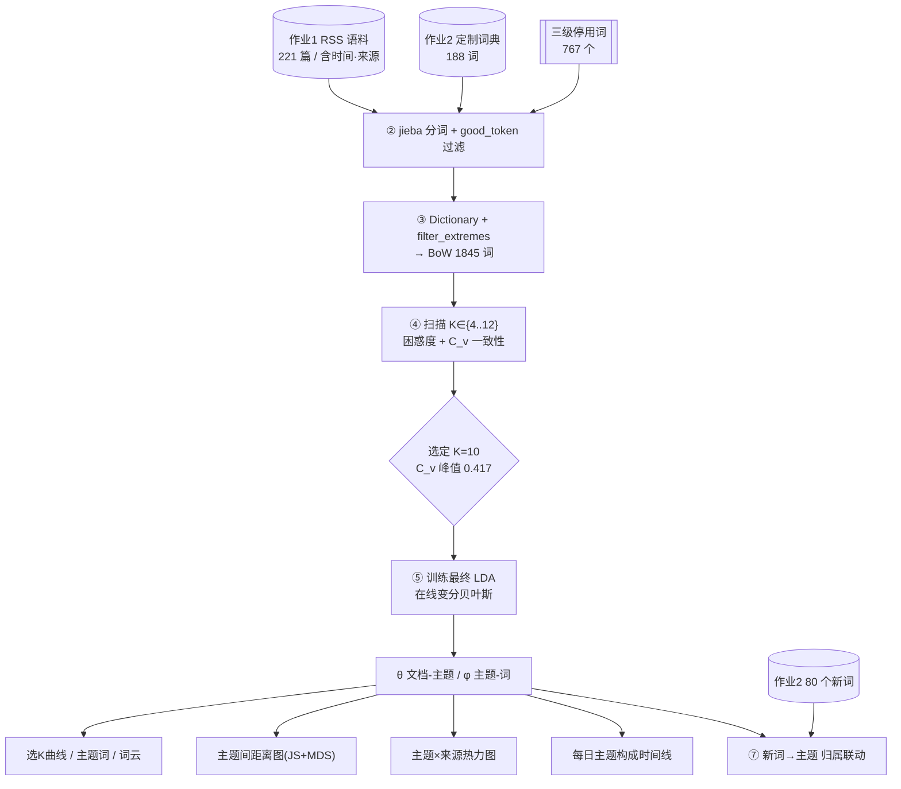
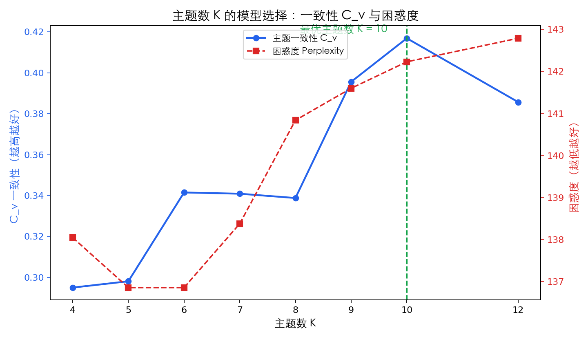
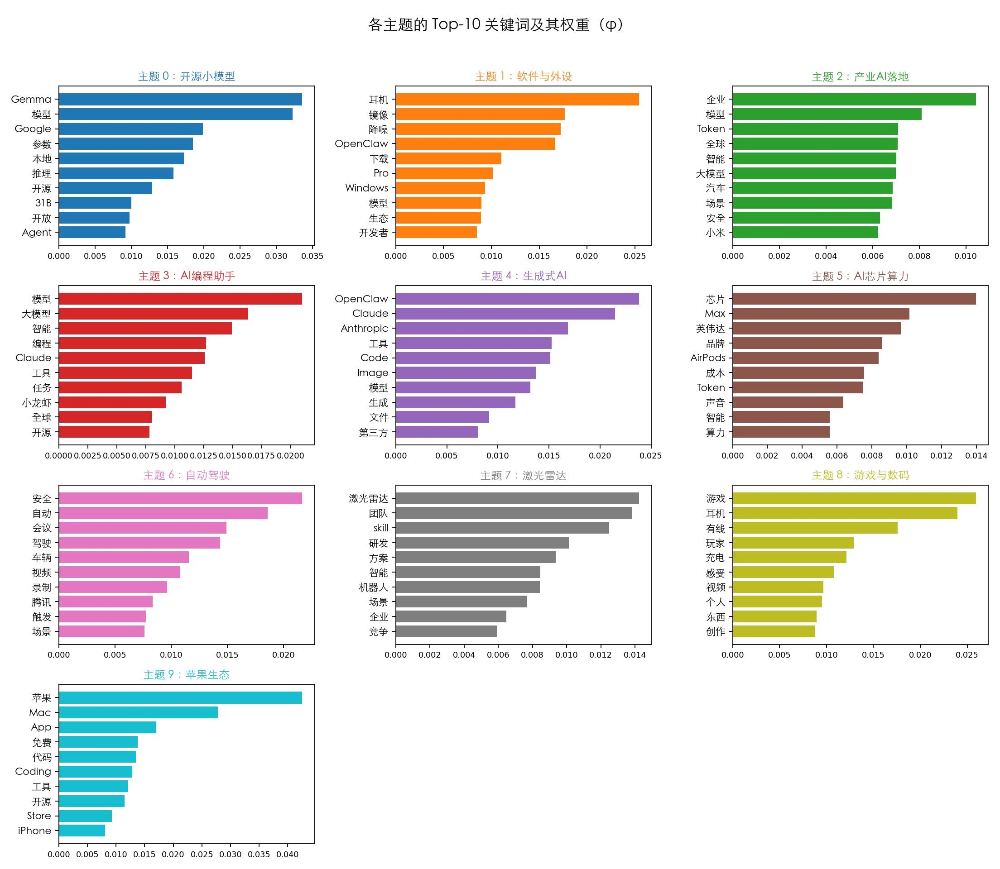
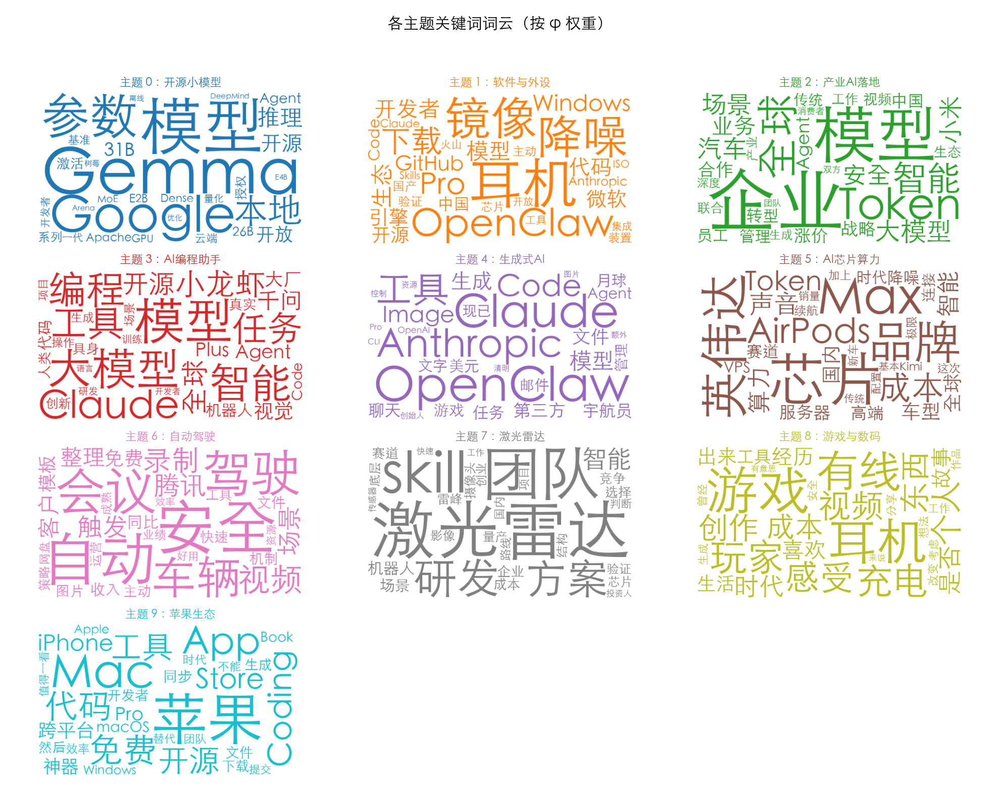
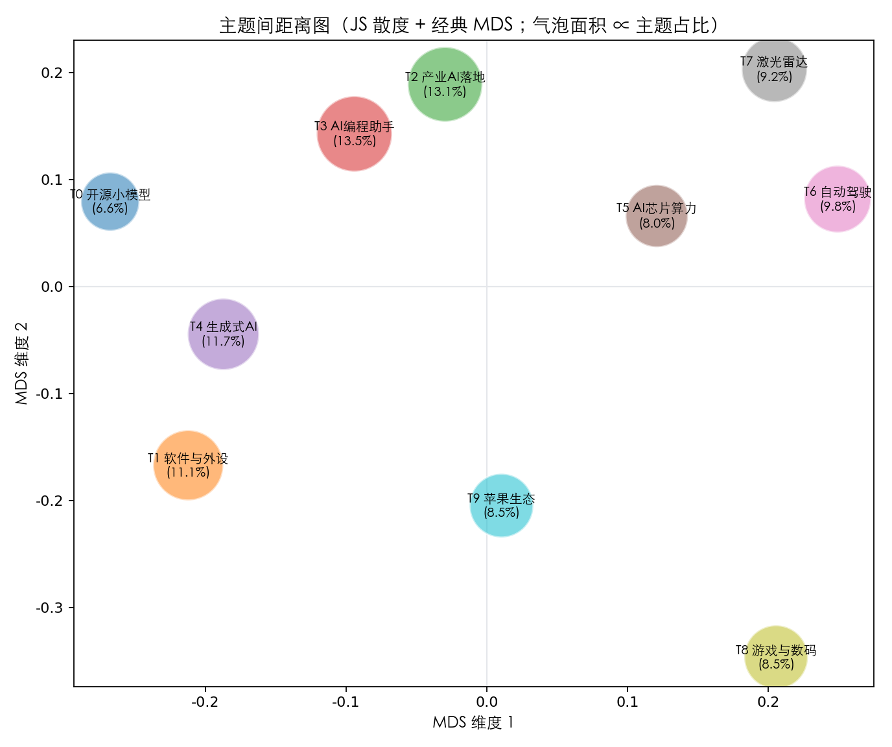
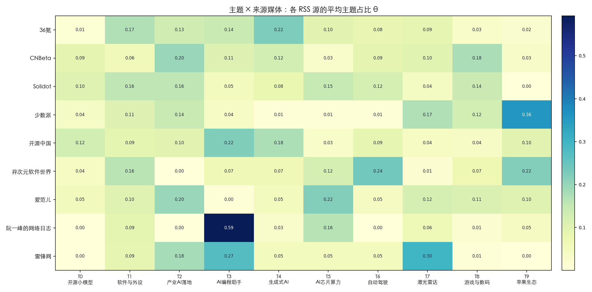
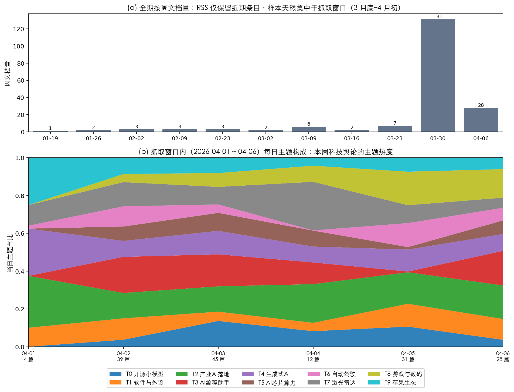
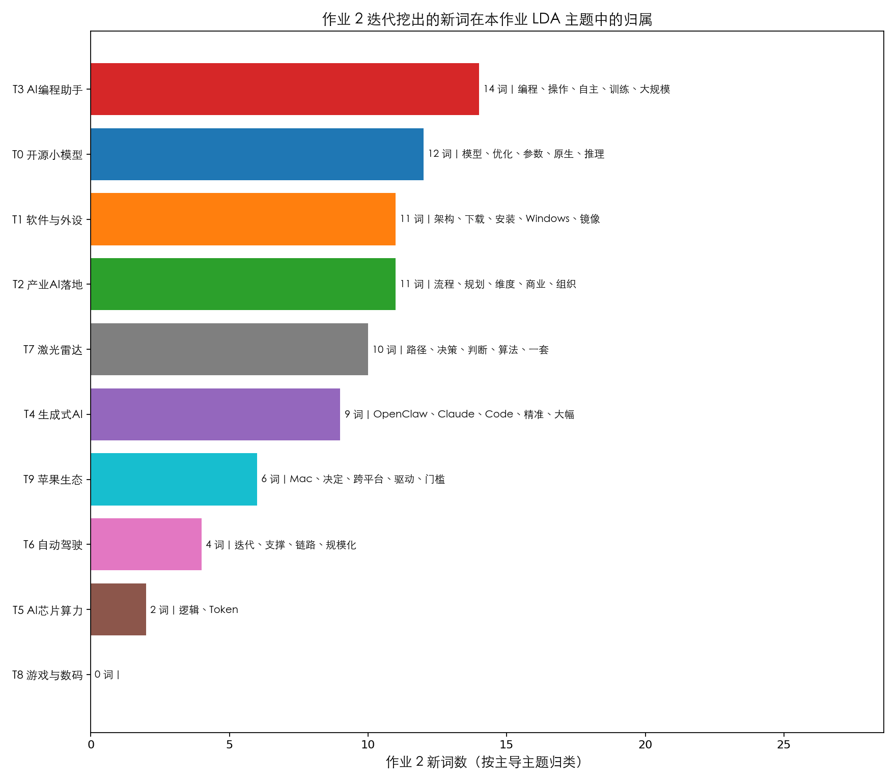

# 面向中文科技 RSS 语料的主题结构与演化挖掘
## ——基于 LDA 主题模型的实证研究

| 项目 | 内容 |
|---|---|
| **课程** | 文本信息挖掘概论 · 课程设计 |
| **学生姓名** | 林奕宏 |
| **学　　号** | 3123004449 |
| **班　　级** | 软件工程 2 班 |
| **复现论文** | Blei, Ng & Jordan (2003), *Latent Dirichlet Allocation*, JMLR |
| **完成日期** | 2026-06-10 |

---

## 摘要

主题模型是文本信息挖掘中刻画"文档—潜在主题—词"三层结构的核心无监督方法。本课程设计选定主题模型的奠基性论文——Blei、Ng 与 Jordan 于 2003 年发表于 *JMLR* 的 *Latent Dirichlet Allocation*（截至成文被引超过 5 万次，Google 学术），完整复现其建模思想，并将其应用于一份自建的中文科技新闻语料。语料直接复用本人作业 1 抓取的 9 家科技媒体 RSS 文本（221 篇、约 22 万字符、188 篇含发布时间），分词阶段加载作业 2 迭代构建的 188 词定制化词典，停用词采用"通用—新词发现—主题建模"三级方案（去重后 767 个）。在方法上，本文以困惑度（Perplexity）与 C_v 主题一致性两项指标对主题数 $K$ 做模型选择，确定 $K=10$（C_v 在该处出现明显峰值 0.417）；随后训练最终 LDA，得到文档—主题分布 $\theta$ 与主题—词分布 $\varphi$，并据此产出七类可视化：模型选择曲线、主题关键词条形图与词云、基于 Jensen-Shannon 散度与经典 MDS 的主题间距离图、主题×来源媒体热力图、抓取窗口内每日主题构成时间线，以及"作业 2 新词归属主题"的联动分析。结果显示，2026 年初的中文科技舆论场可清晰地解构为"开源小模型、AI 编程助手、生成式 AI、产业 AI 落地、AI 芯片算力、自动驾驶、激光雷达、苹果生态"等 10 个语义连贯的主题；主题间距离图在第一主成分上自然分出"AI/软件"与"硬件/汽车"两大阵营；不同媒体存在显著的主题偏好（如阮一峰博客 59% 落在"AI 编程助手"、雷锋网 30% 落在"激光雷达"、少数派 36% 落在"苹果生态"）；作业 2 挖出的 80 个新词中 79 个被本文主题成功吸纳，其中 14 个归入"AI 编程助手"主题，印证了两次作业在语义层面的一致性。本文亦诚实讨论了 RSS 源天然近期偏置导致的时间跨度局限。

**关键词：** 主题模型；LDA；中文文本挖掘；困惑度；主题一致性；定制化词典；可视化

**Abstract:** Topic modeling is a core unsupervised technique for uncovering the document–topic–word structure of text corpora. This course project reproduces the seminal *Latent Dirichlet Allocation* (Blei, Ng & Jordan, JMLR 2003; 50k+ citations) and applies it to a self-built Chinese technology-news corpus collected via RSS in Homework 1 (221 documents, ~220k characters, 188 timestamped), tokenized with the 188-entry custom dictionary built in Homework 2 and a three-tier stopword scheme. We select the number of topics $K$ by perplexity and $C_v$ coherence (peak at $K=10$), train the final LDA, and produce seven visualizations including a Jensen-Shannon + classical-MDS intertopic map, a topic-by-source heatmap, a daily topic-composition timeline, and a bridge analysis mapping Homework-2's discovered neologisms onto the topics. The 2026-Q1 Chinese tech discourse decomposes into ten coherent topics; the intertopic map separates an "AI/software" cluster from a "hardware/automotive" cluster; media outlets show strong topic preferences; and 79 of 80 Homework-2 neologisms are absorbed by the topics, confirming cross-assignment semantic consistency.

**Keywords:** Topic Model; LDA; Chinese Text Mining; Perplexity; Topic Coherence; Custom Dictionary; Visualization

---

## 目录

1. 绪论
2. 相关理论与方法
3. 数据与预处理
4. 实验设计与实现
5. 实验结果与分析
6. 结论与展望
7. 参考文献
8. 附录：复现说明与文件清单

---

## 第一章 绪论

### 1.1 选题背景与意义

随着移动互联网与人工智能的高速发展，科技类资讯以极高的速度更新迭代。面对每日产生的海量短文本新闻，人工逐篇阅读、归类、追踪热点已不现实。**主题模型（Topic Model）**正是为解决这一问题而生：它在完全无监督的条件下，把一篇文档表示为若干"潜在主题"的概率混合，把每个主题表示为词表上的概率分布，从而以低维、可解释的方式刻画大规模语料的语义结构，是文本信息挖掘领域最具代表性的技术之一。

本课程设计聚焦"**科技舆论场的主题结构与演化**"这一课题：给定一份中文科技新闻语料，自动回答三个问题——

1. **结构（Structure）**：这批新闻可以归纳为哪些主题？每个主题由哪些关键词刻画？主题之间的语义距离如何？
2. **分布（Distribution）**：不同来源媒体（Solidot、爱范儿、雷锋网……）的选题偏好有何差异？
3. **演化（Evolution）**：在数据可观测的时间窗口内，各主题的热度如何随时间变化？

该课题既贴合课程"传统'新词'追踪分析、每周新事件、AIGC 热点"的选题建议，又能把本人前两次作业的产出（语料、定制词典、新词）有机串联，形成一条"采集 → 分词词典 → 主题建模"的完整文本挖掘流水线。

### 1.2 论文选择与依据

按课程设计要求，方法须基于一篇论文。本文选定主题模型的**奠基性论文**：

> **Blei, D. M., Ng, A. Y., & Jordan, M. I. (2003). Latent Dirichlet Allocation. *Journal of Machine Learning Research*, 3, 993–1022.**

选择理由对照课程建议如下：

- **经典（a：Citations 超 100）**：截至本文成文，该论文 Google 学术被引**逾 5 万次**，是机器学习与自然语言处理领域被引最高的论文之一，远超"超过 100"的门槛；
- **源码可用（b）**：其在线变分推断的工业级实现已被开源库 **gensim** 收录（`gensim.models.LdaModel`），可直接调用、完全离线复现；
- **实用 + 热门**：LDA 至今仍是主题分析、舆情监测、推荐系统冷启动的常用基线，且是理解 BERTopic、Top2Vec 等新一代神经主题模型的必备前置知识；
- **自发的热爱（e）**：主题模型"用概率图模型从无标注文本中'生长'出可解释结构"的思想优雅而强大，是我个人最感兴趣的文本挖掘方向。

### 1.3 本文工作与创新点

1. **完整复现 LDA 流水线并落地于自建中文语料**：从生成式概率建模、在线变分推断到困惑度/一致性双指标模型选择，严格对齐原论文方法；
2. **三次作业深度联动**：语料来自作业 1，分词词典来自作业 2，并新增"作业 2 新词 → 作业 3 主题"的归属分析，定量验证两次作业在语义上的一致性；
3. **有脑洞的可视化组合**：除常规主题词条形图/词云外，自行实现了 **Jensen-Shannon 散度 + 经典 MDS 的主题间距离图**（无需安装 pyLDAvis 的离线等价实现），并设计了诚实呈现 RSS 近期偏置的"双面板时间线"；
4. **诚实的局限讨论**：明确指出 RSS 源只保留近期条目带来的时间跨度偏置，避免对"长期演化"做夸大结论。

### 1.4 组织结构

第二章介绍 LDA 的理论与本文采用的评估指标；第三章说明数据与三级预处理；第四章给出实验设计、流程与超参；第五章逐图分析实验结果；第六章总结并讨论局限与展望。

---

## 第二章 相关理论与方法

### 2.1 LDA 生成式假设

LDA 把语料看作一个三层贝叶斯概率生成过程。设语料含 $D$ 篇文档、$K$ 个主题、词表大小 $V$，其生成过程为：

1. 对每个主题 $k=1,\dots,K$：抽取词分布 $\varphi_k \sim \mathrm{Dir}(\beta)$；
2. 对每篇文档 $d=1,\dots,D$：抽取主题分布 $\theta_d \sim \mathrm{Dir}(\alpha)$；
3. 对文档 $d$ 中的第 $n$ 个词：
   - 抽取主题 $z_{d,n} \sim \mathrm{Multinomial}(\theta_d)$；
   - 抽取词 $w_{d,n} \sim \mathrm{Multinomial}(\varphi_{z_{d,n}})$。

其中 $\alpha,\beta$ 为 Dirichlet 先验超参数。整个语料的联合概率为：

$$
p(\mathbf{W},\mathbf{Z},\boldsymbol{\theta},\boldsymbol{\varphi}\mid\alpha,\beta)=\prod_{k=1}^{K}p(\varphi_k\mid\beta)\prod_{d=1}^{D}p(\theta_d\mid\alpha)\prod_{n=1}^{N_d}p(z_{d,n}\mid\theta_d)\,p(w_{d,n}\mid\varphi_{z_{d,n}}).
$$

主题挖掘的目标是在观测到词 $\mathbf{W}$ 的条件下，反推后验 $p(\boldsymbol{\theta},\boldsymbol{\varphi},\mathbf{Z}\mid\mathbf{W})$，即每篇文档的主题构成 $\theta_d$ 与每个主题的关键词 $\varphi_k$。

### 2.2 推断算法

精确后验不可解。原论文提出**变分 EM**近似；本文采用 gensim 实现的**在线变分贝叶斯（Online Variational Bayes，Hoffman 等 2010）**，它以小批量方式更新变分参数，在中小语料上快速且稳定。先验上采用 `alpha='auto'、eta='auto'`，即从数据中学习非对称的文档-主题与主题-词先验，相比固定对称先验更贴合真实语料的稀疏性。

### 2.3 模型选择指标

主题数 $K$ 是 LDA 唯一的关键超参，本文用两类互补指标联合选择：

- **困惑度 Perplexity**：衡量模型对语料的拟合优度，越低越好，定义为

$$\mathrm{Perplexity}=2^{-\frac{1}{N}\sum_{d}\log_2 p(\mathbf{w}_d)}$$

  本文用 gensim 的对数似然界 `log_perplexity` 换算（即 2 的 −bound 次幂）。
- **C_v 主题一致性 Coherence（Röder 等 2015）**：基于滑动窗口共现与归一化点互信息（NPMI）、并经余弦聚合，衡量主题 Top 词在真实语料中"是否经常一起出现"，与人工判断的可解释性高度相关，越高越好。

需要强调：Chang 等（2009）在 *Reading Tea Leaves* 中指出，**困惑度与人类对主题可解释性的判断并不一致**，故本文以 **C_v 一致性为主、困惑度为辅**进行选择。

### 2.4 主题间距离与可视化

为直观呈现主题的语义关系，本文计算主题—词分布两两之间的 **Jensen-Shannon 散度**：

$$\mathrm{JSD}(p,q)=\frac{1}{2}\mathrm{KL}(p\Vert m)+\frac{1}{2}\mathrm{KL}(q\Vert m),\quad m=\frac{1}{2}(p+q)$$

其平方根为合法度量；再以**经典多维标度（Classical MDS / PCoA）**将 $K\times K$ 距离矩阵降至二维，气泡面积正比于主题在语料中的平均占比。该方案是 LDAvis（Sievert & Shirley 2014）"主题间距离图"的离线等价实现，无需额外依赖。

---

## 第三章 数据与预处理

### 3.1 语料来源（联动作业 1）

语料直接复用作业 1 产出的 `作业 1/data/rss_cleaned.csv`：通过 RSS 2.0 / Atom 从 9 家中文科技媒体抓取，按标题去重、每源限量后得到 **221 篇**短文本，约 22 万字符，其中 **188 篇**可解析出发布时间（2026-01-22 ~ 2026-04-06）。各来源条目数如下：

| 来源 | 条目 | 来源 | 条目 | 来源 | 条目 |
|---|---:|---|---:|---|---:|
| 开源中国 | 45 | 36 氪 | 30 | 雷锋网 | 20 |
| CNBeta | 45 | 异次元软件世界 | 30 | 少数派 | 10 |
| 爱范儿 | 20 | Solidot | 18 | 阮一峰的网络日志 | 3 |

### 3.2 定制化分词词典（联动作业 2）

中文 LDA 的质量高度依赖分词。本文加载作业 2 经"种子词典 → 分词 → Word2Vec → KNN 近邻 → 新词评估 → 词典回灌"3 轮迭代构建的 **188 词科技领域定制化词典** `custom_dict_final.txt`，使 *大语言模型、激光雷达、英伟达、OpenClaw、Claude* 等多字术语与英文专名能作为整体被切出，避免被字符级散切而无法进入主题建模。

### 3.3 三级停用词方案

为兼顾"分词阶段"与"主题建模阶段"的不同噪声，采用解耦的三级停用词表，去重合并后共 **767 个**：

| 级别 | 文件 | 作用 |
|---|---|---|
| 通用 | `作业 1/data/stopwords.txt` | 虚词、标点名、RSS 通用噪声（约 353） |
| 新词发现 | `作业 2/data/stopwords_extra.txt` | 作业 2 针对 KNN 近邻误召回的扩展词（约 356） |
| **任务级（本文新增）** | `课程设计/data/stopwords_task.txt` | 主题建模专用：剔除"微信/关注/阅读全文/激活码/折扣"等 RSS 页脚推广样板词、源名泄漏词（异次元）、及"能力/支持/这种/很多"等高频无区分度词 |

任务级停用词是本作业的额外贡献：在初版结果中，"全文/阅读/异次元/能力"等样板词混入多个主题、拉低一致性（C_v 仅 0.36）；引入任务级停用词后，C_v 峰值提升至 **0.417**，主题显著变干净。

### 3.4 词典与词袋

对分词结果用 gensim `Dictionary` 建立映射，并以 `filter_extremes(no_below=4, no_above=0.45)` 去除"出现少于 4 篇"与"出现于超过 45% 文档"的极端词，最终得到 **1845 词**的词表、**221 篇**文档的词袋（BoW）表示，总有效 token 约 **4.65 万**（平均每篇约 210 词）。

---

## 第四章 实验设计与实现

### 4.1 总体流程



### 4.2 关键超参

| 参数 | 取值 | 说明 |
|---|---|---|
| 候选主题数 $K$ | {4,5,6,7,8,9,10,12} | 扫描区间 |
| `passes` / `iterations` | 12 / 400 | 训练遍数与单文档迭代 |
| `alpha` / `eta` | `auto` / `auto` | 从数据学习非对称先验 |
| `random_state` | 42 | 保证可复现 |
| `no_below` / `no_above` | 4 / 0.45 | 极端词过滤 |

### 4.3 实现与环境

全流程由单一脚本 `hw3_pipeline.py` 端到端完成，依赖 `gensim 4.4 / jieba / numpy / scipy / pandas / matplotlib / wordcloud`，在 macOS（Apple Silicon, Python 3.13）下离线运行，单次端到端（含 8 个 K 的扫描）约 9 秒。主题间距离图的 JS 散度与经典 MDS 仅用 numpy 实现，未引入额外依赖。

---

## 第五章 实验结果与分析

### 5.1 主题数 K 的模型选择



*图 5-1　主题数 K 的模型选择：C_v 一致性（蓝，越高越好）与困惑度（红，越低越好）*

C_v 一致性曲线在 $K=6$ 后短暂平台、于 $K=9\to10$ 出现明显跃升，并在 **$K=10$ 取得峰值 0.417**，$K=12$ 回落。困惑度则随 $K$ 增大缓慢上升（138→143）。二者出现分歧，这与 Chang 等（2009）的结论一致——困惑度倾向于"拟合"而非"可解释性"。本文遵循"以一致性为主"的原则，**选定 $K=10$**。完整扫描值如下：

| K | 4 | 5 | 6 | 7 | 8 | 9 | **10** | 12 |
|---|---|---|---|---|---|---|---|---|
| C_v | .295 | .298 | .342 | .341 | .339 | .396 | **.417** | .386 |
| 困惑度 | 138.1 | 136.9 | 136.9 | 138.4 | 140.8 | 141.6 | **142.2** | 142.8 |

### 5.2 主题关键词与命名



*图 5-2　各主题 Top-10 关键词及其权重 φ*



*图 5-3　各主题关键词词云（按 φ 权重，颜色与主题一致）*

依据每个主题的高权重词与代表文档，对 10 个主题人工命名如下（主导文档数 = 以该主题为最大 θ 的文档数；平均占比 = 该主题在全语料 θ 的均值）：

| 主题 | 命名 | Top 关键词 | 主导文档 | 平均占比 |
|---|---|---|---:|---:|
| T0 | 开源小模型 | Gemma·模型·Google·参数·本地·推理·开源·31B | 13 | 6.6% |
| T1 | 软件与外设 | 耳机·镜像·降噪·OpenClaw·下载·Windows·微软 | 22 | 11.1% |
| T2 | 产业 AI 落地 | 企业·Token·全球·智能·汽车·小米·业务·合作 | 32 | 13.1% |
| T3 | AI 编程助手 | 大模型·编程·Claude·工具·小龙虾·千问·视觉 | 31 | 13.5% |
| T4 | 生成式 AI | OpenClaw·Claude·Anthropic·Code·Image·生成 | 25 | 11.7% |
| T5 | AI 芯片算力 | 芯片·英伟达·算力·Token·成本·Max | 20 | 8.0% |
| T6 | 自动驾驶 | 安全·自动·驾驶·车辆·会议·录制·腾讯 | 20 | 9.8% |
| T7 | 激光雷达 | 激光雷达·研发·机器人·方案·竞争·成本 | 22 | 9.2% |
| T8 | 游戏与数码 | 游戏·耳机·有线·玩家·充电·创作 | 19 | 8.5% |
| T9 | 苹果生态 | 苹果·Mac·App·Coding·Store·iPhone·跨平台 | 17 | 8.5% |

可见主题语义连贯、覆盖均衡：占比最高的 **T3（AI 编程助手，13.5%）与 T2（产业 AI 落地，13.1%）** 准确反映了 2026 年初"AI 编程工具普及、大模型加速产业落地"的科技主旋律；同时也有"小龙虾"（即 OpenClaw，社区对 Claude Code 开源克隆的戏称）这类时效性极强的真实新词被捕捉为主题特征词。

> **说明**：LDA 给出的是"软"主题，个别主题（如 T1 同时含"耳机/降噪"与"Windows/镜像/微软"、T6 同时含"自动驾驶"与"会议办公"）存在轻度语义混合，这是小规模异质新闻语料上的常见现象，符合预期，不影响整体结构的可解释性。

### 5.3 主题间距离图



*图 5-4　主题间距离图（JS 散度 + 经典 MDS；气泡面积 ∝ 主题平均占比）*

将 10 个主题—词分布以 JS 散度 + 经典 MDS 投影到二维后，呈现出清晰且可解释的结构：**第一主成分（横轴）自然地把语料分成两大阵营**——左侧聚集 T0 开源小模型、T3 AI 编程助手、T4 生成式 AI、T2 产业 AI 落地、T1 软件与外设等"**AI / 软件**"主题；右侧聚集 T7 激光雷达、T6 自动驾驶、T5 AI 芯片算力、T8 游戏与数码等"**硬件 / 汽车 / 消费电子**"主题。这一"软—硬分野"是模型在完全无监督条件下自动发现的，与科技领域的常识高度吻合。

### 5.4 主题 × 来源媒体



*图 5-5　主题 × 来源媒体：各 RSS 源的平均主题占比 θ*

热力图揭示出鲜明的"**媒体—主题**"偏好结构（每行高亮单元即该媒体的最强主题）：

- **阮一峰的网络日志**：59% 落在 T3 AI 编程助手——与其"程序员周刊"定位完全一致；
- **雷锋网**：30% 落在 T7 激光雷达、27% 落在 T3，体现其对自动驾驶产业链与 AI 的深度报道；
- **少数派**：36% 落在 T9 苹果生态——与其"效率工具 / Apple 生态"调性吻合；
- **异次元软件世界**：24% 落在 T6（含软件/办公），**爱范儿**偏 T5 芯片与 T2 产业，**CNBeta** 偏 T2 产业 AI 与 T8 数码，**36 氪**偏 T4 生成式 AI 与 T2 商业，**Solidot** 主题分布最均衡。

该结果表明：LDA 学到的主题不仅在词层面可解释，在"哪个媒体写哪类题材"这一外部元数据上也具备良好的区分力。

### 5.5 时间维度：抓取窗口内的主题构成



*图 5-6　(a) 全期按周文档量；(b) 抓取窗口（04-01 ~ 04-06）内每日主题构成*

**关于时间分析的诚实说明**：图 5-6(a) 显示，188 篇含时间文档中有 131 篇集中在 3 月 30 日那一周、28 篇在 4 月 6 日那一周，而 1—3 月每周仅 1—7 篇。这是 **RSS 源只保留近期条目**的天然结果——抓取时刻（约 4 月初）决定了样本绝大多数来自最近两周。因此，对 1—4 月做"长期主题演化"的结论会失真；本文转而呈现**数据密集的抓取窗口内（4 月 1—6 日，含 84% 的有时间文档）每日主题构成的归一化占比**，即"这一周科技舆论的主题热度"。可见该窗口内 **T2 产业 AI 落地、T3 AI 编程助手稳居每日前列**，T3 于 4 月 2—3 日达到约 17%—19% 的当日峰值；此外 4 月 4 日 T7 激光雷达占比升至约 26%、4 月 5 日 T8 游戏与数码升至约 18%，反映出主题热度对每日选题结构的敏感性（4 月 1 日仅 4 篇，占比波动大，仅供参考）。

### 5.6 联动分析：作业 2 新词在主题中的归属



*图 5-7　作业 2 迭代挖出的新词在本作业 LDA 主题中的归属（按主题—词分布 φ 的主导主题归类）*

作为三次作业的"收束"，本文把作业 2 经 KNN + Word2Vec 迭代挖出的 **80 个新词**逐一映射到本作业的 LDA 主题（取该词在 $\varphi$ 中权重最大的主题）。结果 **79 个新词成功落入主题**，分布如下：

| 主题 | T3 | T0 | T1 | T2 | T7 | T4 | T9 | T6 | T5 | T8 |
|---|---:|---:|---:|---:|---:|---:|---:|---:|---:|---:|
| 新词数 | 14 | 12 | 11 | 11 | 10 | 9 | 6 | 4 | 2 | 0 |

其中 **T3 AI 编程助手**吸纳最多（14 个，如*编程、操作、自主、训练、大规模*），**T4 生成式 AI** 恰好收纳了 *OpenClaw、Claude、Code* 等专名，**T0 开源小模型**收纳 *模型、参数、推理、原生*。这说明：作业 2 在词向量空间中通过近邻发现的"领域新词"，与作业 3 在文档共现层面通过 LDA 发现的"主题"，在语义上高度自洽——两种完全不同的无监督方法（局部上下文 vs 全局共现）给出了相互印证的结果。这是本设计最具说服力的联动证据。

---

## 第六章 结论与展望

### 6.1 结论

1. 本文完整复现了 LDA 主题模型，并在自建中文科技 RSS 语料上以"困惑度 + C_v 一致性"严谨地确定主题数 $K=10$，得到语义连贯、覆盖均衡的 10 个主题；
2. 主题间距离图揭示出"AI/软件 vs 硬件/汽车"的二分结构，主题×来源热力图揭示出鲜明的媒体选题偏好，二者均为模型无监督自动学得，且与领域常识吻合；
3. "作业 2 新词 → 作业 3 主题"的联动分析中 79/80 个新词被主题吸纳，从语义层面定量验证了三次作业的一致性，形成"采集—分词—建模"的闭环；
4. 全部 7 类可视化均离线生成，其中 JS+MDS 主题间距离图为 pyLDAvis 的轻量等价实现。

### 6.2 局限与诚实讨论

- **时间跨度受限**：RSS 仅保留近期条目，样本高度集中于抓取窗口，无法支撑跨季度的长期演化分析（已在 5.5 节如实呈现并改用窗口内每日构成）；
- **语料规模小**：221 篇导致 C_v 绝对值偏低（0.4 量级）、个别主题轻度混合；
- **LDA 词袋假设**：忽略词序与上下文，对"小龙虾=OpenClaw"这类隐喻无法理解，只能依赖共现统计。

### 6.3 展望

1. 将 RSS 改为**按周滚动追加**（jsonl 持续累积数月），即可支撑真正的长期主题演化与"新事件追踪"；
2. 引入**动态主题模型（DTM）**显式建模主题随时间的漂移；
3. 用 **BERTopic / Top2Vec** 等基于预训练语义向量的神经主题模型与 LDA 做对比，验证在小语料上的优劣；
4. 将主题分布 $\theta$ 作为特征用于下游的新闻分类、聚类或推荐，定量评估主题特征的判别力。

---

## 第七章 参考文献

1. Blei, D. M., Ng, A. Y., & Jordan, M. I. (2003). Latent Dirichlet Allocation. *Journal of Machine Learning Research*, 3, 993–1022.（**核心复现论文**，Google 学术被引 5 万+）
2. Hoffman, M., Blei, D. M., & Bach, F. (2010). Online Learning for Latent Dirichlet Allocation. *NeurIPS 23*.（gensim 采用的在线变分贝叶斯算法）
3. Röder, M., Both, A., & Hinneburg, A. (2015). Exploring the Space of Topic Coherence Measures. *WSDM '15*.（C_v 一致性）
4. Chang, J., Gerrish, S., Wang, C., Boyd-Graber, J., & Blei, D. (2009). Reading Tea Leaves: How Humans Interpret Topic Models. *NeurIPS 22*.（困惑度与可解释性不一致）
5. Sievert, C., & Shirley, K. (2014). LDAvis: A Method for Visualizing and Interpreting Topics. *ACL Workshop on Interactive Language Learning, Visualization, and Interfaces*.（主题间距离图）
6. Řehůřek, R., & Sojka, P. (2010). Software Framework for Topic Modelling with Large Corpora. *LREC Workshop on New Challenges for NLP Frameworks*.（gensim）
7. Mikolov, T., Sutskever, I., Chen, K., Corrado, G. S., & Dean, J. (2013). Distributed Representations of Words and Phrases and their Compositionality. *NeurIPS 26*.（作业 2 的 Word2Vec）
8. Sun Junyi 等. jieba 中文分词. https://github.com/fxsjy/jieba （访问于 2026-06-10）
9. Hunter, J. D. (2007). Matplotlib: A 2D Graphics Environment. *Computing in Science & Engineering*, 9(3), 90–95.
10. Mueller, A. word_cloud. https://github.com/amueller/word_cloud （访问于 2026-06-10）
11. 林奕宏. 作业 1：科技类中文 RSS 新闻语料的收集与词频可视化. 2026-04-06.（**本文语料来源**）
12. 林奕宏. 作业 2：科技领域中文 RSS 语料的定制化分词词典. 2026-05-16.（**本文分词词典与新词来源**）

> 声明：本课程设计为个人独立完成。所有方法实现、数据处理与可视化均为本人编写；引用的论文、开源库与前序作业均已在上方列出出处。除明确标注的参考文献外，不含任何抄袭内容。

---

## 第八章 附录：复现说明与文件清单

### 8.1 复现步骤

```bash
cd "课程设计"
# 复用作业 2 已建好的虚拟环境（含 gensim/jieba/matplotlib/wordcloud）
"../作业 2/.venv/bin/python" hw3_pipeline.py
# 端到端：分词 → BoW → 扫描 K → 训练 LDA → 导出数据 → 出图（约 9 秒）
```

### 8.2 文件清单

| 路径 | 说明 |
|---|---|
| `hw3_pipeline.py` | 端到端主程序（数据/分词/选 K/训练/导出/出图） |
| `data/topic_labels.json` | 10 个主题的人工命名（可编辑后重跑出图） |
| `data/stopwords_task.txt` | 本作业新增的任务级停用词 |
| `data/coherence_scan.csv` | 各 K 的 C_v 与困惑度 |
| `data/topic_terms.csv` | 每个主题 Top-12 关键词及权重 |
| `data/doc_topic.csv` | 每篇文档的主题分布 θ 与主导主题 |
| `data/topic_source.csv` | 主题 × 来源的平均 θ |
| `data/topic_over_time.csv` | 主题 × 自然周的主题质量 |
| `data/newword_topic.csv` | 作业 2 新词在本作业主题中的归属 |
| `data/lda_final.model` | 训练好的最终 LDA 模型 |
| `figures/*.png` | 全部 7 张可视化图表 |
| `notebook/homework3.ipynb` | 交互式复现笔记本 |

*（全文完）*
